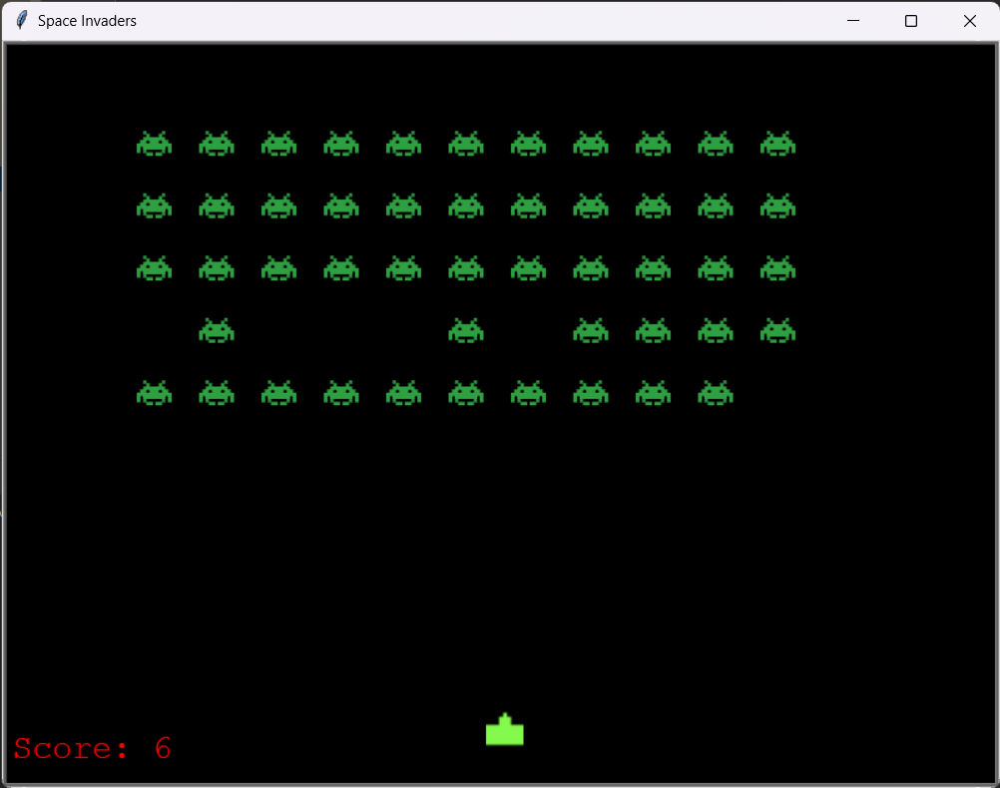

# Introduction
  A clone of the classic arcade game where you shoot down alien ships is built using Python Turtle.

  

## Breakout Games' Requirements

  1. Create eight rows of bricks, with two rows each of a different color. The color order from the bottom up is yellow, green, orange and red. 
  
  2. Create a ball and a paddle and place the bottom on the scrren.
  
  3. Using a single ball, the player must knock down as many bricks as possible by using the walls and/or the paddle below to hit the ball against the bricks and eliminate them.
  
  4. If the player paddle misses the ball's rebound, the player will lose a turn.
  
  5. The player has three turn to complete game, otherwise game is over.
     
  6. The ball hits right and left walls, tha ball bounces.
  
  7. Create a score board.
  
  8. Create a board to show left game rights.  
  
  9. Calculate score according the following rules: Yellow bricks earn one point each, green bricks earn three points, orange bricks earn five points and the top-level red bricks score seven points each.
  
  10. Show total score on the board.
  
  11. The paddle shrinks to one-half its size after the ball has broken through the red row and hit the upper wall.
  
  12. Ball speed increases at specific intervals: after four hits, after twelve hits, and after making contact with the orange and red rows.
  
  13. Calculate left turns and show on the board.
  
  14. The player hits an key strock, game is over.

## Contributing
   Contributions are welcome! Please fork the repository and create a pull request with your changes.
  

## Features

- Python
- Turtle
- OOP
